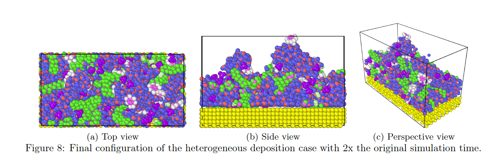
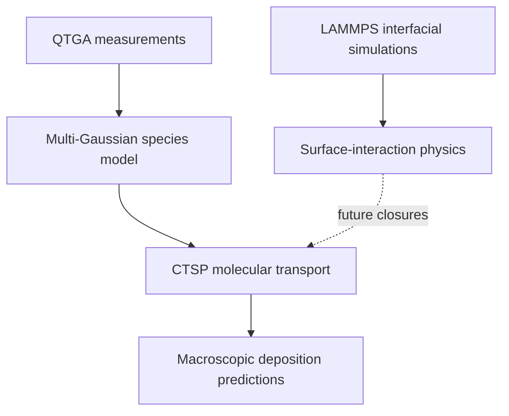
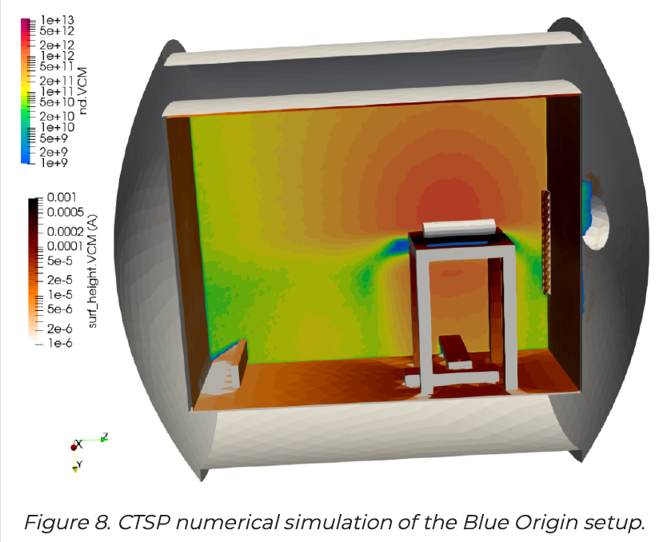

# Spacecraft Contamination Modeling & Simulation

**A multiscale modeling effort connecting QCM-informed spacecraft-level molecular transport with atomistic molecular dynamics of contaminant films.**

<table>
  <tr>
    <th width="50%">System scale — CTSP transport environment</th>
    <th width="50%">Atomistic scale — heterogeneous film evolution</th>
  </tr>
  <tr>
    <td></td>
    <td></td>
  </tr>
  <tr>
    <td>CTSP simulation of the USC experimental configuration. Source: Brieda et al. (2022).</td>
    <td>Final heterogeneous-deposition configuration. Source: Meyer, Brieda, and Wang (2025).</td>
  </tr>
</table>

## Overview

This repository documents nearly two years of multiscale spacecraft-contamination modeling and simulation research. It spans engineering-scale, QCM-derived multispecies gray-body molecular-transport models and atomistic LAMMPS simulations of heterogeneous contaminant-film deposition, morphological evolution, re-adsorption, and thermally activated desorption. The repository includes code, simulation inputs, results, a published conference paper, and a follow-on journal manuscript.

At the engineering scale, Quartz Crystal Microbalance thermogravimetric-analysis (QTGA) signals were separated by multi-Gaussian peak deconvolution into virtual contaminant species with temperature-dependent sticking coefficients and relative outgassing mass fractions. These parameters were propagated through CTSP particle-tracing and view-factor simulations to predict multiple-bounce, non-line-of-sight molecular transport. Across the reported cases, the multispecies parameterization improved experimental correlation by nearly three orders of magnitude relative to the legacy single-species, unitary-sticking-coefficient model, reaching 5.5% error in the six-Gaussian hot-to-cold validation case.

At the atomistic scale, classical non-reactive molecular dynamics resolved adsorbate–adsorbate and adsorbate–substrate interactions in heterogeneous water, hydrocarbon, and nitrogen films on gold. The simulations captured dynamic film restructuring, molecular clustering, re-adsorption, and material-pair-dependent desorption behavior omitted from conventional reduced-order models.

The long-term objective is **atomistically informed model reduction**: translating interfacial-physics insights into species- and material-pair-dependent surface-interaction closures for higher-fidelity, three-dimensional spacecraft-contamination transport simulations.

Put more simply, the atomistic simulations reveal how individual molecules stick, rearrange, and desorb, with the ultimate goal of using those insights to improve macroscale reduced-order models such as Dr. Lubos Brieda's Contamination Transport Simulation Program (CTSP).

## Project at a Glance

| Scale | Core question | Approach | Primary output |
|---|---|---|---|
| Engineering / system | Where does outgassed material travel and redeposit? | QTGA peak deconvolution, multispecies parameterization, CTSP particle tracing, and view-factor transport | Deposition fields and experiment-correlated transport predictions |
| Atomistic / interface | How do mixed contaminant films stick, restructure, and desorb? | Classical non-reactive molecular dynamics in LAMMPS | Molecular configurations, trajectories, and species/material-dependent behavior |
| Cross-scale | Which microscopic effects should improve reduced-order transport models? | Physics interpretation and closure development | Future surface-interaction laws for CTSP-class simulations |

## Technical Contributions

- Developed and evaluated a QCM-derived multispecies representation of spacecraft outgassing and deposition.
- Propagated temperature-dependent sticking behavior and relative species mass fractions through three-dimensional CTSP simulations.
- Built and executed LAMMPS molecular-dynamics cases for deposition, film restructuring, re-adsorption, and thermal desorption.
- Compared model predictions with vacuum-chamber measurements and documented accuracy, limitations, and next-step cross-scale improvements.
- Organized simulation inputs, analysis artifacts, results, and publications to support reproducibility and continued research.

## Multiscale Modeling Architecture

## Engineering-Scale Molecular Transport

The system-scale workflow converts measured QTGA behavior into virtual species, assigns temperature-dependent sticking coefficients and relative mass fractions, and propagates those species through CTSP geometry using particle-tracing and view-factor methods. This supports multiple-bounce transport, including contamination paths that are not line-of-sight.

  

CTSP numerical simulation of the Blue Origin experimental configuration. Source: Brieda et al. (2022).

## Atomistic Molecular Dynamics

The LAMMPS cases model heterogeneous water, hydrocarbon, and nitrogen contamination on gold. They were designed to expose physical behavior that a single effective sticking coefficient cannot represent directly, including molecular clustering, film morphology changes, re-adsorption, and material-pair-dependent thermal response.

## Repository Guide

<!-- Replace the example paths below with the repository's final directory names. -->

| Directory | Contents |
|---|---|
| `ctsp/` | Engineering-scale model inputs, parameter sets, and analysis |
| `lammps/` | Molecular definitions, force-field parameters, data files, and LAMMPS input scripts |
| `scripts/` | Python preprocessing, post-processing, and validation utilities |
| `results/` | Selected plots, tables, and visualization outputs |
| `papers/` | Published conference paper, follow-on manuscript, and relevant supporting references |
| `environment/` | Container information and software/runtime notes |

## Reproducing the Simulations

<!-- Add exact commands after the final files are organized. Keep one verified reference case per workflow. -->

1. Build or pull the documented LAMMPS runtime environment.
2. Place the required molecular definitions and force-field parameter files beside the selected input case.
3. Run one documented reference case using its batch script or direct LAMMPS command.
4. Post-process the trajectory and thermodynamic output using the accompanying Python scripts.
5. Compare the generated result with the reference output in `results/`.

## Key Results

- The QCM-derived multispecies parameterization substantially improved agreement with experiment relative to a unitary-sticking-coefficient model.
- The best reported six-Gaussian hot-to-cold case reached **5.5% error** relative to experiment.
- Atomistic simulations exposed heterogeneous film restructuring, clustering, re-adsorption, and desorption behavior that motivates richer surface-interaction closures.

## Publications

- **Published conference paper:** molecular-dynamics simulations of heterogeneous spacecraft contaminant films (Meyer, Brieda, and Wang, 2025).
- **Follow-on journal manuscript:** QCM-derived multi-Gaussian, multispecies spacecraft-contamination transport modeling.
- **Experimental foundation:** Brieda et al. (2022), *Experimental Investigation of QCM-Derived Sticking Coefficients for Use in Molecular Transport Simulations*.

## Limitations and Future Work

The molecular-dynamics cases are classical and non-reactive, and their finite length and scale do not directly reproduce full mission timescales. The next research step is to reduce the atomistic observations into calibrated, species- and material-pair-dependent sticking, residence-time, or desorption closures and evaluate them in CTSP-class transport simulations against experimental data.

## Figure Credits

The USC and Blue Origin CTSP images originate from Brieda et al. (2022) and are included here as the experimental and system-modeling context used by this research. The heterogeneous-film image originates from Meyer, Brieda, and Wang (2025). Before public release, replace screenshots with author-controlled source exports where available and confirm publisher reuse requirements.

